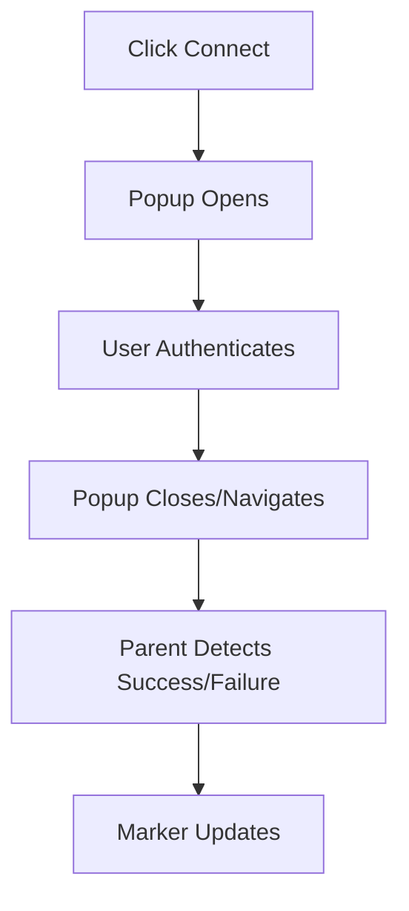

# Connection Status System Documentation

This document summarizes how the Slack and Trello connection markers work in the HRMS admin experience after the 2025-11 overhaul.

## 🎯 Overview

- Popup-based OAuth flow with visual markers (red → blue spinner → green).
- Heuristics determine success when the popup closes or times out.
- Connection state persists for logged-in users across reloads/navigation and resets on logout.
- Guest users get session-scoped state that clears when the tab/window closes.

## 🏗️ Architecture

### Key Pieces

1. **ConnectionStatusIndicator** – renders the icon, colored border, dot, and animations.
2. **ConnectionStatusSection** – the admin dashboard widget that exposes Slack/Trello buttons.
3. **useConnectionStatus** – central hook handling state, storage, timers, and popup detection.

### Flow Diagram



## 🔄 Detection Strategy

1. **Detecting State**  
   - When a popup opens we mark the service as `detecting` (blue spinner) and remember which service triggered it.

2. **Primary Heuristic**  
   - If the popup closes after sufficient interaction time (≥10s) it is treated as a success.  
   - Quick closures (≤10s) still count as success if the closure was triggered by the same service that initiated the flow.

3. **Fallback Heuristics**  
   - URL/title inspection when accessible (e.g. look for `code=` or “success”).  
   - Automatic success after 60s to avoid indefinite spinners.  
   - Query-string detection (`?service=trello&connected=true`) is still supported for future explicit callbacks.

4. **Failures**  
   - Explicit error detections or obvious cancellation revert the marker to red (`disconnected`).

## 💾 Persistence Rules

| Scenario               | Storage                           | Reset Behaviour                  |
|------------------------|-----------------------------------|----------------------------------|
| Logged-in user         | `localStorage` (`hrms_connection_status_v2:...`) | Cleared on logout via sidebar form |
| Guest user             | `sessionStorage` (`...:guest:...`) | Cleared when tab/window closes     |
| Manual reset / logout  | `resetAllConnections()` helper clears timers and storage |

You can scope multiple indicator groups by passing a `scope` and `userId` to `useConnectionStatus`.

```tsx
const {
  connectionState,
  connectServiceViaPopup,
  resetAllConnections,
} = useConnectionStatus({ userId: currentUser?.email, scope: "admin" });
```

## 🚀 Developer Notes

### Adding Another Service

1. Extend the `ConnectionStatus` union and the `ConnectionState` interface in `useConnectionStatus`.
2. Add the service icon asset under `public/images/`.
3. Wire a new `ConnectionStatusIndicator` entry inside `ConnectionStatusSection`.
4. Provide a URL for `connectServiceViaPopup` (usually the provider’s OAuth entry point).

### Handling Logout

The sidebar logout form clears all stored connection keys:

```tsx
clearConnectionKeys(window.localStorage);
clearConnectionKeys(window.sessionStorage);
```

If you trigger logout somewhere else, call `resetAllConnections()` or replicate the same storage cleanup.

## 🧪 Testing Checklist

1. Click Slack/Trello, complete auth, ensure marker turns green.
2. Reload while logged in – markers stay green.
3. Log out – markers return to red (storage cleared).
4. As a guest, close and reopen the tab – markers start red again.
5. Cancel popup quickly – marker reverts to red.
6. Leave popup open >60s – marker auto-resolves to green.

## 🔍 Troubleshooting

- **Stuck in blue** – check DevTools console for `[ConnectionStatus]` logs. Call `resetAllConnections()` and retry.
- **Popup blocked** – instruct the browser to allow popups for the domain.
- **Providers rejecting auth** – verify OAuth redirect URLs and credentials in provider dashboards.

## 📌 Future Enhancements

- Reintroduce explicit callback pages if Slack/Trello flows change to require them.
- Move connection persistence to the backend once integration APIs are available.
- Provide mobile-specific fallbacks where popups are unreliable.

