# Connection Status System Documentation

This document explains how the connection status system works for Slack and Trello integrations in the HRMS application.

## 🎯 Overview

The connection system provides visual feedback and status tracking for external service connections (Slack and Trello). It uses a popup-based OAuth flow instead of full page redirects for better user experience.

## 🏗️ Architecture

### Components

1. **ConnectionStatusIndicator** - Visual indicator showing connection status
2. **ConnectionStatusSection** - Container component for multiple connection indicators
3. **useConnectionStatus** - Custom hook managing connection states
4. **ConnectionCallbackPage** - Handles OAuth callback redirects
5. **ConnectionMessenger** - Utility for communicating with parent windows

### Connection Flow

```mermaid
graph TD
    A[User clicks Connect] --> B[Popup Opens]
    B --> C[User completes OAuth]
    C --> D[Service redirects to callback URL]
    D --> E[Callback page detects success/failure]
    E --> F[Messenger sends message to parent]
    F --> G[Parent window updates status]
    G --> H[Visual indicator shows success ✓]
```



## 🔄 How Connection Detection Works

### 1. Popup Flow (Primary Method)

When a user clicks a connection button:

1. **Popup Opens**: External service opens in a popup window
2. **Message Listening**: Parent window listens for postMessage events
3. **Success Detection**: External service calls the messenger utility
4. **Status Update**: Parent window updates connection status immediately

### 2. URL Parameter Detection (Fallback)

If popup messaging fails:

1. **URL Parameters**: Callback page checks URL for `success=true` or `connected=true`
2. **State Management**: Updates connection status based on parameters
3. **Auto Redirect**: Redirects back to admin page after showing result

### 3. Polling Mechanism (Additional Fallback)

If both above methods fail:

1. **URL Monitoring**: System polls popup URL for success indicators
2. **Timeout Handling**: Fails after 60 seconds if no success detected
3. **Popup Closure**: Detects when popup closes without success

## 🚀 Usage

### For Users

1. Click the Slack or Trello connection icon
2. Complete OAuth flow in the popup window
3. Connection status updates automatically with visual feedback

### For Developers

#### Adding New Services

1. Add service to `ConnectionStatus` type:

```typescript
export type ConnectionStatus =
  | "connected"
  | "disconnected"
  | "loading"
  | "error";
```

2. Update the connection state interface:

```typescript
interface ConnectionState {
  slack: ConnectionStatus;
  trello: ConnectionStatus;
  yourService: ConnectionStatus; // Add new service
}
```

3. Add service icon and configuration to `ConnectionStatusIndicator`

#### Custom Callback URLs

For external services, use these URL patterns:

- **Success**: `https://yourapp.com/admin/connection-callback?service=slack&success=true`
- **Failure**: `https://yourapp.com/admin/connection-callback?service=slack&error=access_denied`

#### External Service Integration

Include the connection messenger in your OAuth callback pages:

```html
<!-- Option 1: Use the provided HTML template -->
<iframe
  src="https://yourapp.com/connection-messenger.html"
  style="display:none;"
></iframe>

<!-- Option 2: Use the JavaScript API directly -->
<script>
  // Auto-detect success/failure from URL
  window.ConnectionMessenger.sendSuccess("slack");
  // or
  window.ConnectionMessenger.sendFailure("slack", "User denied access");
</script>
```

## 🔧 Configuration

### Environment Variables

```env
# OAuth Callback URLs
NEXT_PUBLIC_SLACK_CLIENT_ID=your_slack_client_id
NEXT_PUBLIC_TRELLO_API_KEY=your_trello_api_key

# Custom redirect URLs (if different from default)
NEXT_PUBLIC_SLACK_REDIRECT_URI=https://yourapp.com/admin/connection-callback
NEXT_PUBLIC_TRELLO_REDIRECT_URI=https://yourapp.com/admin/connection-callback
```

### Styling

The system uses Tailwind CSS classes for styling. Customize in:

- `app/components/ConnectionStatusIndicator/ConnectionStatusIndicator.css`
- `app/components/ConnectionStatusIndicator/ConnectionStatusIndicator.tsx`

## 🛡️ Security Considerations

### Origin Validation

Always validate message origins in production:

```javascript
window.addEventListener("message", (event) => {
  // Validate origin
  if (event.origin !== "https://yourapp.com") return;

  // Process message
  if (event.data.type === "CONNECTION_SUCCESS") {
    // Handle success
  }
});
```

### CSRF Protection

Use state parameters to prevent CSRF attacks:

```javascript
const state = generateSecureRandomString();
const authUrl = `https://slack.com/oauth/authorize?state=${state}`;
```

## 📱 Mobile Considerations

- Popups may not work well on mobile browsers
- Consider fallback to redirect flow for mobile users
- Test thoroughly on different devices and browsers

## 🧪 Testing

### Manual Testing

1. Click connection button
2. Complete OAuth flow in popup
3. Verify status updates correctly
4. Test both success and failure scenarios

### Automated Testing

```javascript
// Test connection status updates
describe("Connection Status", () => {
  it("should update status on successful connection", () => {
    // Mock postMessage
    window.postMessage(
      {
        type: "CONNECTION_SUCCESS",
        service: "slack",
      },
      "*"
    );

    // Verify status changed to connected
    expect(connectionState.slack).toBe("connected");
  });
});
```

## 🔍 Troubleshooting

### Common Issues

1. **Popups Blocked**: Browser blocks popups

   - Solution: Allow popups or use redirect flow

2. **Messages Not Received**: CORS issues

   - Solution: Ensure proper origin validation

3. **Status Not Updating**: Event listeners not set up
   - Solution: Check that message handlers are registered

### Debug Mode

Enable debug logging:

```javascript
// In useConnectionStatus hook
console.log("Connection status updated:", newState);
```

## 📈 Future Enhancements

- Webhook support for real-time updates
- Batch connection status checking
- Connection expiration handling
- Service-specific error messages
- Analytics tracking for connection attempts

## 🤝 Contributing

When adding new connection services:

1. Follow the established patterns
2. Add comprehensive error handling
3. Include fallback mechanisms
4. Update documentation
5. Add tests

---

For questions or support, please refer to the main application documentation or contact the development team.
